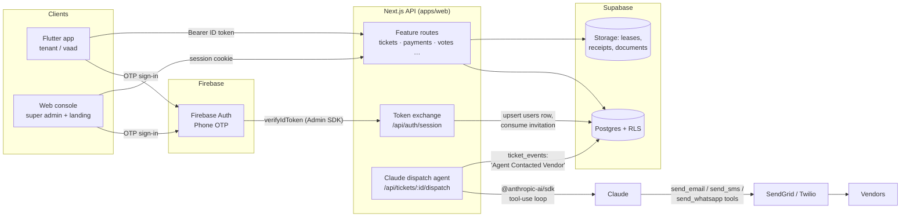

# Dira — Multi-Tenant Building Management SaaS

A monorepo for a building-management platform: residents and building
committees (Vaad) use a **Flutter mobile app**; platform operators use a
**Next.js web console**; a **Claude-powered agent** dispatches approved
maintenance tickets to vendors automatically.

```
dira/
├── apps/
│   ├── web/        Next.js 16 (App Router) — landing page, super-admin
│   │               console, and ALL backend API routes (used by mobile too)
│   └── mobile/     Flutter app — tenant & Vaad experience (phone OTP login,
│                   tickets, payments, directory, docs, assemblies)
├── supabase/
│   ├── migrations/ 0001_schema.sql · 0002_rls.sql · 0003_storage.sql
│   └── seed.sql    super-admin allowlist bootstrap
└── firebase-service-account.json   (git-ignored; local dev only)
```

## System architecture



### Auth model (Firebase Auth ↔ Supabase Postgres)

1. Client signs in with **Firebase Phone OTP** and gets an ID token.
2. `POST /api/auth/session` verifies it with the **Firebase Admin SDK**, then
   fetches/creates the `users` row in Supabase:
   - phone on the `super_admins` allowlist → role `super_admin`
   - matching pending `invitations` row → role/building/apartment from invite
   - otherwise a bare profile that must redeem an invite code at onboarding
3. Web gets a 14-day **session cookie**; the Flutter app sends the Firebase
   **Bearer ID token** on every request instead.
4. Server routes use the Supabase **service-role key** (RLS bypassed) and
   enforce tenancy in code. The RLS policies in `0002_rls.sql` are
   defense-in-depth and also enable direct client reads if you register
   Firebase as a **Third-Party Auth provider** in Supabase
   (Dashboard → Authentication → Third-Party → Firebase, project
   `buildingo-6ff54`); they key off `auth.jwt()->>'sub'` = Firebase UID.

### Claude vendor dispatch (the "Approve & Dispatch Agent" flow)

1. Tenant submits a ticket → `tickets` row + `Reported` timeline event.
2. Vaad taps **Approve & Dispatch Agent** and picks a configured
   `vendor_agents` row (contacts, contract, extra AI instructions).
3. `POST /api/tickets/:id/dispatch` runs a Claude tool-use loop
   (`apps/web/src/lib/agent/dispatch.ts`) with `send_email`, `send_sms`,
   `send_whatsapp` tools; executions go through SendGrid/Twilio (logged and
   skipped gracefully when unconfigured).
4. Every vendor contact writes an **"Agent Contacted Vendor"** `ticket_events`
   row (the timestamped timeline in the app), and the full Claude transcript
   is stored on `tickets.agent_log`.

## Setup

### 1. Database (Supabase)

Run in the SQL editor (or `supabase db push`), in order:

1. `supabase/migrations/0001_schema.sql`
2. `supabase/migrations/0002_rls.sql`
3. `supabase/migrations/0003_storage.sql`
4. `supabase/seed.sql` — **first replace the phone number** with yours; that
   number becomes the super admin on first sign-in.
5. Later migrations in `supabase/migrations/` (e.g. `0018_schedule_events.sql`
   for the building schedule, `0019_building_whatsapp.sql` for WhatsApp/WAHA,
   `0020_announcement_event_date.sql` for dated announcements)
   — run each new file in the SQL editor when added.

### 2. Web (`apps/web`)

```bash
npm install            # from repo root (npm workspaces)
npm run dev:web        # http://localhost:3000
```

`apps/web/.env.local` is pre-filled with the Firebase client config and the
Supabase secret key. **Still required:**

| Variable | Where to find it |
|---|---|
| `SUPABASE_URL` | Supabase Dashboard → Settings → API (`https://<ref>.supabase.co`) |
| `ANTHROPIC_API_KEY` | console.anthropic.com |
| `SENDGRID_*` / `TWILIO_*` | optional — real vendor emails/SMS/WhatsApp + invite SMS |

Also enable **Phone** as a sign-in provider: Firebase Console →
Authentication → Sign-in method → Phone. Add test phone numbers there for
development without real SMS.

### 3. Mobile (`apps/mobile`)

Firebase apps are already registered (`com.dira.dira_mobile` /
`com.buildingo.buildingoMobile`) and `lib/firebase_options.dart` is generated;
`google-services.json` and `GoogleService-Info.plist` are in place.

```bash
cd apps/mobile
flutter run --dart-define=API_BASE_URL=http://<your-mac-ip>:3000
```

Notes for phone auth on device:
- **Android**: add your debug SHA-256 to the Firebase project
  (Console → Project settings → Android app) and download the refreshed
  `google-services.json`; Play Integrity backs OTP on real devices.
- **iOS**: enable push notifications or the reCAPTCHA fallback (add the
  `REVERSED_CLIENT_ID` URL scheme from `GoogleService-Info.plist` once the
  OAuth client exists). Firebase test numbers work in the simulator.

### 4. Hosting (landing + super-admin + API)

The Next.js app (`apps/web`) deploys with **Firebase App Hosting** on
project `buildingo-6ff54`. That requires the **Blaze** billing plan
(Console → Usage and billing → Modify plan).

```bash
# From repo root (after Blaze is enabled):
firebase use buildingo-6ff54

# One-time: create the backend (skip if buildingo-api already exists)
firebase apphosting:backends:create \
  --backend buildingo-api \
  --primary-region us-central1 \
  --root-dir apps/web \
  --app 1:848466124816:web:00f734d593d6821065aa95

# One-time: store secrets in Secret Manager
firebase apphosting:secrets:set SUPABASE_SECRET_KEY
firebase apphosting:secrets:set ANTHROPIC_API_KEY
firebase apphosting:secrets:set FIREBASE_SERVICE_ACCOUNT_JSON   # paste JSON or base64
firebase apphosting:secrets:set CONTACT_EMAIL                   # support form inbox

# Ship a rollout (builds from the linked git repo / local config)
firebase apphosting:rollouts:create buildingo-api
```

Non-secret env lives in `apps/web/apphosting.yaml`. After deploy, point
mobile `API_BASE_URL` at the App Hosting URL (release builds default to
`https://buildingo-api--buildingo-6ff54.us-central1.hosted.app`), and map
custom domain `buildingo.com` in Firebase Console → App Hosting → Domain.

```bash
cd apps/mobile
flutter build ipa --release \
  --dart-define=API_BASE_URL=https://buildingo-api--buildingo-6ff54.us-central1.hosted.app
```

- **DB/Storage → Supabase** (already hosted).
- Classic Hosting site `https://buildingo-6ff54.web.app` exists but cannot
  run the Next.js API/admin by itself — use App Hosting.

### 5. Test users

Firebase test phone numbers (Console → Authentication → Sign-in method →
Phone). No real SMS is sent — the verification code for **all** of them
is `111111`. The occupied ones live in the building
**מייזנר 17, פתח תקווה**:

| Phone | Role | Name | Apartment |
|---|---|---|---|
| `+972547788999` | Super admin | — | — (web console only) |
| `+972547760683` | Vaad | אוהד קצב | Apt 2, floor 1 |
| `+972548899656` | Tenant | אבנר נתניהו | Apt 15, floor 5 |
| `+972548899653` | *free* | — | for testing new sign-ups / invites |
| `+972547777777` | *free* | — | for testing new sign-ups / invites |

### PII encryption (production)

Tenant phone numbers, names, and emails are stored encrypted in Postgres when
`PII_SECRET_KEY` is set. HMAC hash columns (`phone_number_hash`, `email_hash`)
enable indexed lookups without exposing raw values.

1. Run migration `supabase/migrations/0022_pii_encryption.sql` in the Supabase SQL editor.
2. Generate a key: `openssl rand -base64 32` → add to `apps/web/.env.local` as `PII_SECRET_KEY`.
3. Backfill existing rows: `npm run backfill:pii --workspace=@dira/web`.
4. New writes automatically encrypt; the API decrypts only for authorized callers.

Without `PII_SECRET_KEY`, dev mode keeps plaintext columns (backward compatible).

## End-to-end walkthrough

1. Super admin signs in at `/login` (web) → `/admin`: creates a building with
   its apartments, invites the first **Vaad** member by phone number.
2. Vaad member installs the app, signs in with the same phone → invite
   auto-matches → onboarding (name, occupants) → full Vaad tools.
3. Vaad invites tenants unit-by-unit from the Directory tab; tenants onboard
   the same way (optional lease upload → `leases` bucket).
4. Vaad configures a **Vendor Agent** (Maintenance tab → robot icon), e.g.
   "Schindler Elevator Service", with email/phone and contract details.
5. Tenant reports "Elevator stuck" → Vaad taps **Approve & Dispatch Agent**
   → Claude emails/texts the vendor → the home-screen timeline advances to
   *Claude AI Dispatching* with the vendor-contact timestamp.
6. Payments tab: Vaad generates the month's dues from each unit's fee, marks
   payments received, records expenses — tenants see their own ledger and the
   building balance.
7. Assemblies: Vaad publishes an agenda with a Yes/No vote (one ballot per
   apartment, DB-enforced) and afterwards **Close & publish summary** — Claude
   writes the recap, it's rendered to PDF, stored in the documents vault and
   announced on the community board.
